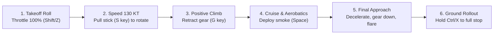

# JASDF Matsushima Air Base (RJST) Blue Impulse 3D Flight Simulator<br>Desktop Application User Manual & Flight Operations Guide (English Edition)

A native 3D aerobatic and formation flight simulator built with Tauri 2.0 and WebGL (Three.js), featuring the Japan Air Self-Defense Force (JASDF) 4th Air Wing 11th Squadron "Blue Impulse" (Kawasaki T-4) at Matsushima Air Base (RJST, Higashimatsushima, Miyagi Prefecture: 38.408646N, 141.215081E).

---

## 📑 Table of Contents
1. [Simulator Overview & Highlights](#1-simulator-overview--highlights)
2. [System Requirements & Installation](#2-system-requirements--installation)
   - [2-1. macOS Installation & Launch](#2-1-macos-installation--launch)
   - [2-2. Windows Installation & Launch](#2-2-windows-installation--launch)
   - [2-3. Development & Building from Source](#2-3-development--building-from-source)
3. [Screen Layout & UI Architecture](#3-screen-layout--ui-architecture)
4. [Flight Modes & Features](#4-flight-modes--features)
   - [4-1. 👥 5-Ship Formation Mode](#4-1--5-ship-formation-mode)
   - [4-2. 🛩️ Solo 1-Jet Mode](#4-2-️-solo-1-jet-mode)
5. [Flight Controls & Complete Keyboard Shortcuts](#5-flight-controls--complete-keyboard-shortcuts)
6. [Flight Procedures & Pilot Guide (Takeoff, Aerobatics, Landing Full Stop)](#6-flight-procedures--pilot-guide-takeoff-aerobatics-landing-full-stop)
7. [7 Official Blue Impulse Display Routines](#7-7-official-blue-impulse-display-routines)
8. [Camera Views & Perspective Highlights](#8-camera-views--perspective-highlights)
9. [Smoke, Environment, Audio & Collision Systems](#9-smoke-environment-audio--collision-systems)
10. [Troubleshooting & Frequently Asked Questions (FAQ)](#10-troubleshooting--frequently-asked-questions-faq)

---

## 1. Simulator Overview & Highlights

* **Real DEM Elevation Terrain & Orthomosaic Imagery**:
  Built from high-precision GeoTIFF elevation data (`miyagi_sendai.tif`) spanning the Sendai plains, Matsushima Bay, Ishinomaki, and the Oshika Peninsula as a 1536×1024 Float32 mesh, mapped with Geospatial Information Authority of Japan (GSI) high-resolution aerial orthomosaic textures (3072×2048).
* **Matsushima Air Base (RJST) Precision Modeling**:
  * Main Runway 07/25 (2,700m × 45m, Magnetic Heading 068°/248°)
  * Cross Runway 15/33 (1,500m × 45m)
  * Dedicated Blue Impulse apron, hangars, 45m ATC Control Tower, PAPI glide path lights, runway edge lights, and taxiway illumination.
* **Kawasaki T-4 "Blue Impulse" 3D Aircraft Models**:
  * Authentic white & cobalt blue aerobatic livery with #1 to #6 aircraft decals, transparent canopy, and pilot models.
  * Articulated tricycle landing gear, ventral aerodynamic speedbrake, animated ailerons, elevators, and rudder control surfaces.
  * Twin IHI F3-IHI-30 turbofan engines with throttle-modulated exhaust glow and dynamic acoustic engine synthesis.
* **Realistic Takeoff Sequence**:
  Faithfully reproduces the real Blue Impulse routine: simultaneous 4-ship diamond takeoff followed by #5 solo runway hold, low-angle roll-on liftoff, and high-speed aerial join-up.
* **Standalone Desktop Performance**:
  Native Rust + Tauri 2.0 runtime combined with hardware-accelerated WebGL 2.0 (Three.js), enabling 60 FPS performance without requiring an active internet connection.

---

## 2. System Requirements & Installation

### System Requirements
* **macOS**: macOS 10.15 (Catalina) or later (Optimized for Apple Silicon M1/M2/M3/M4 & Intel Mac)
* **Windows**: Windows 10 / 11 (64-bit)
* **Graphics / GPU**: WebGL 2.0 / DirectX 11 capable GPU (Apple Silicon GPU, Intel Iris/UHD, NVIDIA GeForce, AMD Radeon)
* **Memory (RAM)**: 4 GB minimum (8 GB+ recommended)
* **Input**: Keyboard (Required), Mouse or Trackpad

---

### 2-1. macOS Installation & Launch

1. Double-click the distributed disk image `BlueImpulseSimulator_1.0.0_aarch64.dmg` (or appropriate `.dmg` file) to mount it.
2. In the installer window, drag and drop the **BlueImpulseSimulator** application icon into the **Applications** folder shortcut.
3. Launch **BlueImpulseSimulator** from your Applications folder or Spotlight.

> [!NOTE]
> If macOS displays *"BlueImpulseSimulator cannot be opened because the developer cannot be verified"*:
> 1. Open `System Settings` ➔ `Privacy & Security`.
> 2. Scroll down to the Security section and click **"Open Anyway"** next to BlueImpulseSimulator.
> 3. Alternatively, right-click (or Control-click) the application in Finder and select **"Open"**, then click **"Open"** in the confirmation dialog.

---

### 2-2. Windows Installation & Launch

1. Download and double-click `BlueImpulseSimulator_1.0.0_x64-setup.exe`.
2. Follow the setup wizard to complete the installation (a desktop shortcut will be created automatically).
3. Launch **BlueImpulseSimulator** from your Desktop or Start Menu.

> [!NOTE]
> If Windows Defender SmartScreen displays a warning, click **"More info"** and then select **"Run anyway"**.

---

### 2-3. Development & Building from Source

For developers wishing to run or build the desktop app from source:

```bash
# Navigate to desktop project directory
cd flight_blueimpulse_desktop

# Install frontend dependencies (first time only)
npm install

# Start Tauri desktop app in development mode (hot-reloading enabled)
npm run dev:desktop
# or
npx tauri dev

# Build production installer (DMG on macOS / EXE on Windows)
npm run build:desktop
# or
npx tauri build
```

---

## 3. Screen Layout & UI Architecture

```
+---------------------------------------------------------------------------------------------------------+
| [RJST Runway 07/25]       [1:Global][2:👑#1][3:🪶#2][4:🪶#3][5:🎯#4][6:⚡#5][7:Chase][8:Tower][9:Ground] [🖥️- + ↺] [JA/EN] [📖Manual] |
+---------------------------------------------------------------------------------------------------------+
| [◀ PFD HUD]             [ 🛫 Dynamic Flight Directive Instruction Overlay ]                  [Control Panel ◀]|
| (Pitch ladder,           (Takeoff roll, rotation speed, gear retraction, formation alignment, | - 5-Ship / Solo Tab |
|  Horizon, FPV,            aerobatic guidance, final approach glideslope, braking prompt)       | - Auto / Manual Sub |
|  Airspeed KT / Mach,                                                                          | - View / Routine    |
|  Altitude FT / M,                                                                             | - Smoke / Weather   |
|  G-meter, Gear/Brake)                                                                         | - Pilot Livery/Badge|
+---------------------------------------------------------------------------------------------------------+
| [◀Dock] [⏮ ⏪ ▶ ⏸ ⏩ 🔄 🔊] [================== Timeline Seekbar ==================] [Telemetry & Sync Score] |
+---------------------------------------------------------------------------------------------------------+
```

1. **Top Header Bar**:
   * **Airfield & Runway Status**: RJST Runway 07/25, Field Elevation 2.5m.
   * **Camera View Quick Selector**: Cockpit views (#1 to #5), 5-Ship Global, Chase, ATC Tower, and Ground Spectator.
   * **UI Scaling Controls (`🖥️ - / + / ↺`)**: Scale UI by ±5% (65% to 130%), reset to default (85%).
   * **Language Switcher (`JA / EN`)**: Instant toggle between Japanese and English.
   * **User Manual Modal (`📖 Manual`)**: Open/close the in-app interactive manual.
2. **Top-Left Primary Flight Display (PFD HUD)**:
   * Artificial horizon, pitch ladder, and roll angle indicator.
   * Flight Path Vector (FPV) bore-sight indicator.
   * Left: Airspeed (Knots KT) & Mach number.
   * Right: Barometric Altitude (Feet FT) & Metric Altitude (M).
   * Top: Heading compass tape (HDG), active boarded role badge, smoke status.
   * Bottom: G-Force meter with high-G warning (>7.5G alert), Landing Gear (GEAR), Speedbrake (SPD BRAKE).
   * Collapsible via `◀` header button or `[H]` key.
3. **Top-Center Flight Directive Overlay (Pilot Guidance Banner)**:
   * Real-time flight coaching displaying actionable instructions during manual flight: takeoff roll, rotation, climb, formation hold, aerobatic maneuvers, approach descent, touchdown flare, and ground wheel braking.
   * Toggle on/off anytime with `[I]` key or panel button.
4. **Right Control Panel**:
   * Mode switch: **5-Ship Formation Mode** vs **Solo 1-Jet Mode**.
   * Sub-mode switch: **Auto Display (Spectator Replay)** vs **Manual Piloting (Pilot Challenge)**.
   * Selectors for routine, formation shape, smoke settings, environmental lighting presets, and custom pilot liveries.
   * Collapsible via `◀ / ▶` button.
5. **Bottom Telemetry & Timeline Dock**:
   * Playback controls: Play/Pause (`▶ / ⏸`), Speed multiplier (`0.5x / 1.0x / 2.0x / 4.0x`), Replay (`🔄`), Audio mute/unmute (`🔊`).
   * Interactive routine progress seekbar.
   * Live digital telemetry: Airspeed, Altitude, Vertical Speed, Heading, G-Force, Throttle %, Gear / Airbrake status.
   * **Real-time Formation Synchronicity Score** (RANK S: 92%+, RANK A: 82%+, RANK B: 68%+, RANK C).
   * Collapsible via `▲ / ▼` button or `[T]` key.

---

## 4. Flight Modes & Features

### 4-1. 👥 5-Ship Formation Mode

#### Auto Display Replay (Spectator Mode)
Watch Blue Impulse's official aerobatic demonstration routines in automated flight. Seamlessly switch between the 5 cockpit perspectives during the flight:

| Cockpit View | Squadron Role | Visual Experience |
| :--- | :--- | :--- |
| **👑 #1 Lead** | Flight Leader | Front-row view commanding the formation with wingmen arranged behind. |
| **🪶 #2 Wing** | Left Wingman | Close-up vantage point locking onto #1 to the right-front and #4 to the right. |
| **🪶 #3 Wing** | Right Wingman | Close-up vantage point locking onto #1 to the left-front and #4 to the left. |
| **🎯 #4 Slot** | Slot Pilot | Spectacular angle tucked directly beneath and behind the leading diamond triad. |
| **⚡ #5 Solo** | Lead Solo | Dramatic view holding on the runway, executing low-angle roll liftoff, and joining the formation. |

#### Manual Piloting (Squadron Pilot Challenge)
Take the controls of any aircraft in the formation while companion AI pilots execute the routine alongside you:

* **Boarding 👑 #1 Lead (Flight Leader)**:
  You control the lead aircraft. Wingmen #2 through #5 (AI) dynamically match your velocity and attitude while preserving strict formation geometry.
* **Boarding 🪶 #2 / #3 Wing (Wingmen)**:
  Fly as a wingman pilot, maintaining exact spacing relative to the AI leader.
* **Boarding 🎯 #4 Slot (Slot Pilot)**:
  Fly in the slot position directly behind the lead triad.
* **Boarding ⚡ #5 Solo (Lead Solo)**:
  Execute high-speed dynamic maneuvers and spiral around the 4-ship formation.
* **🎨 Distinct Pilot Aircraft Livery**:
  Your manually controlled jet is rendered in customizable special liveries (**Special Gold Leader**, **Crimson Red**, **Cyber Neon**, **Stealth Carbon**, **Sakura Pink**) with an overhead 3D player badge for instant identification in video recordings and screenshots.
* **💥 Mid-Air Collision Detection**:
  Coming within 6.5 meters of an AI wingman triggers an immediate **MID-AIR COLLISION** termination with proximity warning cues.
* **🏆 Formation Synchronicity Score**:
  Tracks positional, heading, and velocity accuracy relative to the ideal routine route in real time.

---

### 4-2. 🛩️ Solo 1-Jet Mode

A streamlined single-jet environment designed to fully unleash the agile performance of the Kawasaki T-4 without formation constraints.

* **Auto Display Routines**:
  1. Solo Vertical Loop & Barrel Roll
  2. Continuous Spiral Roll (Corkscrew)
  3. Runway 07 Takeoff & High-Alpha Climb
  4. Combat Pitch Break & Runway Landing
* **Manual Free Flight**:
  Freely take off from Runway 07, explore Matsushima Bay, perform unrestricted aerobatics, and practice precision landings. Includes quick-spawn presets: Runway 07 Threshold, Airborne over Matsushima Bay (2,500ft, 250kt), and Runway 07 Final Approach (1,000ft, 140kt, Gear Down).

---

## 5. Flight Controls & Complete Keyboard Shortcuts

### Flight Controls (Standard Aviation Flight Scheme)

| Action | Keyboard Key | Control Panel / Mouse | Description |
| :--- | :--- | :--- | :--- |
| **Pitch Up (Climb / Rotate)** | **`S`** or **`↓` (Down Arrow)** | — | **Pull stick back** (Takeoff rotation & climb) |
| **Pitch Down (Descend / Level)** | **`W`** or **`↑` (Up Arrow)** | — | **Push stick forward** (Level off & descent) |
| **Roll (Bank Left / Right)** | `A` (Left) / `D` (Right) or `←` / `→` | — | Deflect ailerons to bank the aircraft |
| **Yaw (Rudder / Ground Steering)** | `Q` (Left) / `E` (Right) | — | Vertical rudder / Ground nosewheel steering |
| **Throttle (Thrust Up / Down)** | `Shift` / `Z` (Increase)<br>`Ctrl` / `X` / `F` (Decrease) | Throttle Slider (0–100%) | Engine power (100% Takeoff, 60% Cruise, 0% Idle) |
| **Landing Gear** | `G` | `[G] Gear` Button | Toggle tricycle landing gear retraction/extension |
| **Speedbrake (Aerodynamic Brake)** | `B` | `[B] Airbrake` Button | Deploy ventral speedbrake for in-flight deceleration |
| **Wheel Brakes (Ground Full Stop)** | **`Ctrl` / `X` / `F` (Hold on ground)** or **`B`** | — | **Hold after touchdown to brake to a complete stop** |
| **Smoke System** | `Space` or `V` | `Smoke ON/OFF` Button | Toggle smoke generator (White / Tricolor / Rainbow) |
| **Flight Guidance Toggle** | `I` | `Guide ON/OFF` Button | Toggle on-screen flight directive banner |
| **Flight Restart / Reset** | `R` | `Restart [R]` Button | Instantly restart flight at takeoff position |

---

### UI Navigation & Display Controls

| Function | Keyboard Key | Control Panel / Mouse | Description |
| :--- | :--- | :--- | :--- |
| **Collapse Top-Left PFD HUD** | `H` | Tile header / `◀ ▶` | Minimize or expand top-left PFD HUD |
| **Collapse Bottom Telemetry Dock** | `T` | Dock header / `▲ ▼` | Minimize (mini meters) or expand bottom dock |
| **Collapse Right Control Panel** | — | Panel top-right `◀ / ▶` | Minimize or expand right flight settings panel |
| **UI Zoom Out (Scale Down)** | `[` | Header `🖥️ -` | Decrease UI scale by 5% increments |
| **UI Zoom In (Scale Up)** | `]` | Header `🖥️ +` | Increase UI scale by 5% increments |
| **Reset UI Scale** | `Ctrl + 0` / `Alt + 0` / `Cmd + 0` | Header `↺` Button | Reset UI scale to default (85%) |
| **User Manual Modal** | `M` (Toggle) / `Esc` (Close) | Header `📖 Manual` | Open or close interactive manual modal |
| **Language Toggle** | — | Header `JA / EN` | Switch between Japanese and English |

---

### Camera View Shortcuts

| Key | 👥 5-Ship Formation Mode View | 🛩️ Solo 1-Jet Mode View |
| :---: | :--- | :--- |
| **`1`** | 🌐 5-Ship Global Overhead View | ✈️ Cockpit FPV |
| **`2`** | 👑 #1 Lead Cockpit FPV (Flight Leader) | 🎥 Formation Chase Camera |
| **`3`** | 🪶 #2 Wingman Cockpit FPV (Left Wing) | 🪶 Wingtip Action Camera |
| **`4`** | 🪶 #3 Wingman Cockpit FPV (Right Wing) | 🗼 Matsushima ATC Tower Camera (45m Telephoto) |
| **`5`** | 🎯 #4 Slot Cockpit FPV (Slot Position) | 🎪 Ground Spectator Camera (Apron View) |
| **`6`** | ⚡ #5 Solo Cockpit FPV (Lead Solo) | 🔄 360° Orbit Camera |
| **`7`** | 🎥 Formation Chase Camera | — |
| **`8`** | 🗼 Matsushima ATC Tower Camera (45m Telephoto) | — |
| **`9`** | 🎪 Ground Spectator Camera (Apron View) | — |

---

## 6. Flight Procedures & Pilot Guide (Takeoff, Aerobatics, Landing Full Stop)



### 🛫 Takeoff Procedure
1. **Advance Throttle to 100%**:
   - Press and hold `Shift` (or `Z`) to set engine throttle to **100%**.
2. **Runway Centerline Tracking**:
   - Use rudder (`Q` / `E`) for subtle nosewheel corrections to track Runway 07 centerline.
3. **Rotation & Liftoff**:
   - As airspeed reaches **130 KT (~67 m/s)**, smoothly pull back on the stick by pressing **`S` (or `Down Arrow`)** to rotate the nose up 10°–15°.
4. **Gear Retraction**:
   - Once safely airborne with positive climb confirmed, press **`G`** to retract the landing gear.
5. **Transition to Cruise**:
   - Level off at 1,500–2,500 FT, reducing throttle to 60–70% for standard cruise at 250 KT.

---

### 🛩️ Aerobatic Maneuvers & Smoke
* **Smoke Generator**: Press `Space` (or `V`) to toggle smoke on/off.
* **Inside Loop**: Enter at 300–350 KT, pull stick `S` smoothly to maintain 3.5–4.5G throughout the vertical circle.
* **Barrel Roll**: Coordinate pitch `S` and aileron `A` / `D` to trace an imaginary helix around your flight vector.

---

### 🛬 Final Approach, Landing & Full Stop Procedure
1. **Approach Preparation (3–5 km out)**:
   - Press `G` to **extend landing gear** (verify green GEAR annunciator on HUD).
   - Press `B` to **deploy speedbrake**, and tap `Ctrl` / `X` / `F` to decelerate to **120–140 KT (~60–70 m/s)**.
2. **Runway Alignment (Final Approach)**:
   - Line up with Runway 07 (heading 068°) or Runway 25 (heading 248°), holding a 3° glideslope (vertical descent rate ~-3 to -4 m/s, ~-600 to -800 FPM).
3. **Touchdown Flare**:
   - At 5–10 meters above the threshold, gently tap **`S` (or `Down Arrow`)** to raise the nose slightly (flare maneuver), setting the main gear down softly (touchdown descent rate < -3 m/s).
4. **Braking to Full Stop**:
   - Immediately after touchdown, press and hold **`Ctrl` (or `X` / `F`)** to drop throttle to 0% (idle).
   - **Holding `Ctrl` / `X` / `F`** or pressing **`B`** engages the high-friction **wheel brakes**.
   - Steer with rudder (`Q` / `E`) along the centerline until reaching a complete, smooth stop (0 KT).

---

## 7. 7 Official Blue Impulse Display Routines

1. **4-Ship Diamond Takeoff & #5 Solo Roll-on Aerial Join-up**:
   Authentic simultaneous 4-ship diamond liftoff followed by #5 solo low-angle roll-on takeoff, climbing rapidly to join the formation into a 5-ship delta.
2. **Delta Loop & Roll**:
   Enters at 350 KT in tight 5-ship delta formation, pulling a 4G vertical loop with a barrel roll at the apex.
3. **Star Cross**:
   Vertical climb bursting into a 5-way fan break, carving a massive 5-pointed star across the sky with smoke.
4. **Level Sunrise**:
   Low-altitude horizontal delta opening into a 5-way fan burst in all directions.
5. **Changeover Turn**:
   Enters in trail formation, sweeping through a wide-radius turn while morphing cleanly into diamond and delta formations.
6. **Corkscrew**:
   1–4 Lead triad trails straight white smoke while #5 Solo rolls in a continuous barrel roll helix around the smoke core.
7. **Rolling Combat Pitch & Formation Landing**:
   Low pass over Runway 07 followed by sequential overhead pitch breaks into a synchronized landing sequence.

---

## 8. Camera Views & Perspective Highlights

* **Pilot Head-Look (Cockpit FPV)**:
  Realistically articulates the pilot's line of sight toward the lead aircraft or turn apex based on bank angle and pitch.
* **ATC Tower Camera (Tower Cam)**:
  Telephoto camera mounted at the top of the 45m Matsushima control tower, automatically tracking approaching, departing, and flyby aircraft.
* **Ground Spectator Camera (Apron View)**:
  Simulates the perspective of an airshow attendee watching from the flightline apron.
* **360° Free Orbit Camera**:
  Allows full mouse-drag rotation around the aircraft in Solo mode.

---

## 9. Smoke, Environment, Audio & Collision Systems

* **Smoke Color Modes**:
  * `⚪ White`: High-density standard JASDF white smoke.
  * `🔴🔵 Tricolor`: #1/#4/#5 (White), #2 (Blue), #3 (Red) display smoke.
  * `🌈 Rainbow`: 5 distinct vivid colors across the formation.
* **Environmental & Lighting Presets**:
  * `Clear Day`: Crisp blue sky and ocean reflection over Matsushima Bay.
  * `Sunset Golden Hour`: Warm twilight glow with dramatic aircraft silhouettes.
  * `Airshow High Overcast`: Diffuse lighting maximizing smoke trail contrast.
  * `Night Flight`: Matsushima runway and approach lighting in dark night skies.
* **WebAudio Acoustic Synthesis Engine**:
  * Dual IHI F3 turbofan engine sound with RPM modulation and spool latency.
  * Dynamic aerodynamic wind noise, transonic shockwaves, smoke hiss, gear actuation whir, tire squeal, and brake sounds.
  * Mid-air proximity warning tones and collision audio.
* **Collision Detection Engine**:
  * Terrain impact (mountains, ocean, urban structures).
  * Hard landing impacts (> 8.5 m/s descent rate), belly landings (gear up), and extreme touchdown attitudes (> 28° bank).
  * Mid-air formation wingman collision (< 6.5m proximity).

---

## 10. Troubleshooting & Frequently Asked Questions (FAQ)

### Q1. macOS shows "BlueImpulseSimulator cannot be opened because the developer cannot be verified"
**A:** This is standard macOS Gatekeeper verification for non-App-Store apps:
1. Open `System Settings` ➔ `Privacy & Security`.
2. Scroll to Security and click **"Open Anyway"** next to BlueImpulseSimulator.
3. Alternatively, right-click the application in Finder and select **"Open"**.

### Q2. I cannot hear engine or jet audio
**A:** WebAudio policies require user interaction before playing audio. Click inside the simulator window or press any key to initialize audio. Check that audio is not muted on the bottom dock (`🔊` button).

### Q3. The aircraft won't take off or gain speed
**A:** Ensure engine throttle is set to **100%** by holding `Shift` or `Z`. When airspeed reaches 130 KT, **pull back on the stick by pressing `S` (or `Down Arrow`)** to lift the nose. (Note: `W` pushes the nose down).

### Q4. The aircraft crashes every time upon landing
**A:** Check the following 3 points:
1. Press `G` to **extend landing gear** (verify GEAR display on HUD).
2. Just before touchdown, tap `S` to **flare** and reduce descent rate below -3 m/s.
3. Immediately after touchdown, hold `Ctrl` or `X` to **reduce throttle to 0% and engage wheel brakes**.

### Q5. The UI is too large or too small for my screen
**A:** Press `[` to scale down or `]` to scale up the UI by 5%. Press `Ctrl + 0` (or `Alt + 0` / `Cmd + 0`) to reset to the default 85% scale. You can also click the `🖥️ - / + / ↺` buttons in the top header.
