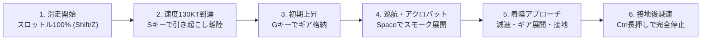

# 航空自衛隊 松島基地 (RJST) ブルーインパルス 3Dフライトシミュレーター<br>デスクトップアプリケーション 総合取扱説明書・操作マニュアル (日本語版)

川崎重工 T-4「ブルーインパルス（Blue Impulse）」の 3D アクロバット飛行および編隊飛行を、航空自衛隊 松島基地（宮城県東松島市、38.408646N, 141.215081E）の実地形・実機離陸シークエンスのもとで体験できる、Tauri 2.0 ベースのデスクトップ専用フライトシミュレーターです。

---

## 📑 目次
1. [シミュレーターの概要と特徴](#1-シミュレーターの概要と特徴)
2. [動作環境とインストール手順](#2-動作環境とインストール手順)
   - [2-1. macOS でのインストールと起動](#2-1-macos-でのインストールと起動)
   - [2-2. Windows でのインストールと起動](#2-2-windows-でのインストールと起動)
   - [2-3. 開発ソースコードからの起動・ビルド](#2-3-開発ソースコードからの起動ビルド)
3. [画面構成・UIレイアウト](#3-画面構成uiレイアウト)
4. [モード別機能解説](#4-モード別機能解説)
   - [4-1. 👥 5機編隊モード](#4-1--5機編隊モード)
   - [4-2. 🛩️ 1機ソロモード](#4-2-️-1機ソロモード)
5. [操縦方法・全キーボードショートカット一覧](#5-操縦方法全キーボードショートカット一覧)
6. [フライト手順・操縦ガイド（離陸・機動・着陸完全停止）](#6-フライト手順操縦ガイド離陸機動着陸完全停止)
7. [ブルーインパルス 7大公式アクロバット演目解説](#7-ブルーインパルス-7大公式アクロバット演目解説)
8. [カメラ視点と視界の特徴](#8-カメラ視点と視界の特徴)
9. [スモーク・環境天候・サウンド・衝突判定システム](#9-スモーク環境天候サウンド衝突判定システム)
10. [トラブルシューティング & よくある質問 (FAQ)](#10-トラブルシューティング--よくある質問-faq)

---

## 1. シミュレーターの概要と特徴

* **実地形 DEM 標高データ & 航空写真**:
  宮城県域（仙台・松島湾・石巻・牡鹿半島・奥羽山脈）の起伏データを 1536×1024 メッシュの Float32 DEM として生成し、国土地理院（GSI）の空中写真オルソモザイク（3072×2048）を貼り合わせたフォトリアルな 3D 地形。
* **松島基地 (RJST) 精密モデリング**:
  * メイン滑走路 07/25（2,700m × 45m、磁方位 068°/248°）
  * クロス滑走路 15/33（1,500m × 45m）
  * ブルーインパルス専用エプロン、格納庫群、高さ45mの管制塔、PAPI 進入角指示灯、滑走路灯・誘導路灯火。
* **川崎重工 T-4「ブルーインパルス」3D 機体モデル**:
  * 鮮やかなホワイト＆コバルトブルー塗装、1〜6番機デカール、キャノピー＆パイロット。
  * 可動式三輪着陸脚（ギア）、スピードブレーキ（胴体下）、エルロン・エレベーター・ラダーの舵面連動。
  * IHI F3-IHI-30 ターボファン双発エンジン（スロットル連動エキゾーストグローおよび物理音響合成）。
* **リアルな実機離陸シークエンス**:
  実機と同じ「1〜4番機ダイヤモンド同時離陸 ＋ 5番機滑走路待機→低角ロール離陸→空中合流」を再現。
* **デスクトップネイティブ高速動作**:
  Rust + Tauri 2.0 バックエンドと WebGL 2.0 (Three.js) を組み合わせ、インターネット接続不要の完全オフライン・60FPS 高速動作を実現。

---

## 2. 動作環境とインストール手順

### システム要件
* **macOS**: macOS 10.15 (Catalina) 以降（Apple Silicon M1/M2/M3/M4 および Intel Mac 対応）
* **Windows**: Windows 10 / 11 (64-bit)
* **GPU**: WebGL 2.0 / DirectX 11 対応グラフィックス（Intel Iris/UHD、Apple Silicon GPU、NVIDIA GeForce、AMD Radeon）
* **メモリ**: 4GB 以上の RAM（推奨 8GB 以上）
* **入力デバイス**: キーボード（必須）、マウスまたはトラックパッド

---

### 2-1. macOS でのインストールと起動

1. 配布パッケージ `BlueImpulseSimulator_1.0.0_aarch64.dmg`（または対応する DMG ファイル）をダブルクリックして開きます。
2. 表示されたウィンドウで、**BlueImpulseSimulator** のアイコンを **Applications（アプリケーション）** フォルダにドラッグ＆ドロップします。
3. 「アプリケーション」フォルダから **BlueImpulseSimulator** を起動します。

> [!NOTE]
> 初回起動時に「開発元を検証できないため開けません」と表示された場合：
> 1. `システム設定` ➔ `プライバシーとセキュリティ` を開きます。
> 2. 下部にある「"BlueImpulseSimulator" は開発元を確認できないため開けませんでした」の横にある **「このまま開く (Open Anyway)」** をクリックしてください。
> 3. または、Finder でアプリケーションを **右クリック（または Control + クリック）して「開く」** を選択します。

---

### 2-2. Windows でのインストールと起動

1. インストーラー `BlueImpulseSimulator_1.0.0_x64-setup.exe` をダウンロードしてダブルクリックします。
2. 画面の指示に従ってインストールを完了します（デスクトップにショートカットが作成されます）。
3. デスクトップまたはスタートメニューの **BlueImpulseSimulator** を起動します。

> [!NOTE]
> Windows Defender SmartScreen の警告が表示された場合は、**「詳細情報」** をクリックし、**「実行」** ボタンを押してください。

---

### 2-3. 開発ソースコードからの起動・ビルド

開発者向けにソースコードから直接起動・ビルドすることも可能です。

```bash
# プロジェクトフォルダへ移動
cd flight_blueimpulse_desktop

# 依存パッケージのインストール (初回のみ)
npm install

# デスクトップアプリの開発モード起動 (ホットリロード対応)
npm run dev:desktop
# または
npx tauri dev

# デスクトップアプリのプロダクションビルド (DMG / EXE / APP 作成)
npm run build:desktop
# または
npx tauri build
```

---

## 3. 画面構成・UIレイアウト

```
+---------------------------------------------------------------------------------------------------------+
| [松島基地 (RJST) 07/25]   [1:全体][2:👑1番][3:🪶2番][4:🪶3番][5:🎯4番][6:⚡5番][7:後方][8:塔][9:観覧]  [🖥️- + ↺] [JA/EN] [📖マニュアル]|
+---------------------------------------------------------------------------------------------------------+
| [◀ PFD HUD計器]         [ 🛫 リアルタイムフライト指導バナー (Instruction Overlay) ]         [フライト操作パネル ◀]|
| (ピッチラダー,           (離陸手順、ギア操作、目標速度/高度、アプローチ指示、キーガイド)          | - 5機編隊 / 1機ソロ |
|  人工水平線, FPV,                                                                         | - 演目鑑賞 / 手動操縦 |
|  対気速度/マッハ,                                                                         | - 視点・搭乗機・演目 |
|  高度FT/M, 昇降計,                                                                        | - スモーク・環境・天候 |
|  G負荷・舵面・脚表示)                                                                      | - 自機リバリー・マーカー |
+---------------------------------------------------------------------------------------------------------+
| [◀ドック] [⏮ ⏪ ▶ ⏸ ⏩ 🔄 🔊] [================ タイムラインシーク ================] [テレメトリ計器群・シンクロ率] |
+---------------------------------------------------------------------------------------------------------+
```

1. **上部ヘッダーバー (Top Header)**:
   * **基地・滑走路情報**: 松島基地 Runway 07/25、標高 2.5m を表示。
   * **カメラ視点クイック切替ボタン**: コックピット視点（1〜5番機）、全体、後方、管制塔、観覧席。
   * **UI 画面縮尺コントロール (`🖥️ - / + / ↺`)**: UIサイズを 5% 単位で拡大・縮小（65%〜130%）、標準（85%）へリセット。
   * **言語切替 (`JA / EN`)**: 日本語／英語の即時切り替え。
   * **マニュアル表示ボタン (`📖 マニュアル`)**: 取扱説明書ダイアログを開閉。
2. **左上 PFD HUD 計器 (Primary Flight Display)**:
   * 人工水平線、ピッチラダー、ロール角度インジケーター。
   * 中央 FPV（フライトパスベクター / 機首進行方向マーカー）。
   * 左側：対気速度（ノット KT）＆ マッハ数（Mach）。
   * 右側：気圧高度（フィート FT）＆ メートル換算高度（M）。
   * 上部：方位コンパステープ（HDG）、搭乗機バッジ、スモーク稼働表示。
   * 下部：Gメーター（過大G警告 7.5G+）、着陸脚（GEAR）、スピードブレーキ（SPD BRAKE）。
   * 折りたたみボタン（`◀` または `[H]` キー）で最小化可能。
3. **中央上部 フライト指導バナー (Flight Directive Overlay)**:
   * 手動操縦時に離陸滑走、引き起こし、上昇、編隊追従、アクロバット、着陸進入、接地、完全停止まで的確なパイロット指示をリアルタイム表示。
   * `[I]` キーまたは操作パネルのスイッチでいつでも ON / OFF 切替可能。
4. **右側 統合操作パネル (Right Control Panel)**:
   * **5機編隊モード / 1機ソロモード** の切り替えタブ。
   * **演目鑑賞 (オート再生)** / **手動操縦 (パイロット搭乗)** の切り替え。
   * 演目セレクター、隊形セレクター、スモーク設定、天候環境プリセット、自機特別リバリー選択。
   * 折りたたみボタン（`◀ / ▶`）で最小化可能。
5. **下部 テレメトリ＆タイムラインドック (Bottom Dock)**:
   * 再生／一時停止（`▶ / ⏸`）、再生速度切替（`0.5x / 1.0x / 2.0x / 4.0x`）、リプレイ（`🔄`）、消音切替（`🔊`）。
   * 演目タイムラインシークバー（任意の位置へジャンプ可能）。
   * デジタル計器パネル（対気速度、高度、昇降率、方位、G負荷、スロットル、ギア、エアブレーキ）。
   * **リアルタイム編隊シンクロ率スコア**（RANK S: 92%+, RANK A: 82%+, RANK B: 68%+, RANK C）。
   * 折りたたみボタン（`▲ / ▼` または `[T]` キー）で最小化可能。

---

## 4. モード別機能解説

### 4-1. 👥 5機編隊モード

#### 演目鑑賞（オート再生）
ブルーインパルスの公式アクロバット演目を自動飛行で鑑賞します。演目実行中、**どの機体のコックピットから眺めるか**（1〜5番機）や、編隊後方・地上管制塔・観覧席からの大迫力アングルを自由に切り替えられます。

| コックピット視点 | ポジション | 視点の特徴 |
| :--- | :--- | :--- |
| **👑 1番機** | 編隊長 (Flight Leader) | 最前列から滑走路や空を見渡し、後方に2〜5番機を従えるリーダー視点。 |
| **🪶 2番機** | 左翼機 (Left Wingman) | 右前方に1番機、右隣に4番機を見ながら緊密に追従する視点。 |
| **🪶 3番機** | 右翼機 (Right Wingman) | 左前方に1番機、左隣に4番機を見ながら緊密に追従する視点。 |
| **🎯 4番機** | スロット (Slot) | 前方の1番機、左右の2・3番機がつくるダイヤモンドの直後下から見上げる大迫力視点。 |
| **⚡ 5番機** | リードソロ (Lead Solo) | 滑走路で待機後、単独低角ロール離陸を行い、先行する4機に空中合流する視点。 |

#### 手動操縦（パイロット搭乗チャレンジ）
自分が搭乗する機体を選択して、自らの操縦桿で編隊飛行やアクロバットに参加します。

* **👑 1番機 (編隊長) に搭乗**:
  あなたが編隊のリーダーとして操縦桿を握ります。2〜5番機（AI）が隊形を維持してあなたの機体にリアルタイムで追従します。
* **🪶 2番機 / 3番機 (左翼・右翼) に搭乗**:
  編隊飛行を担う僚機パイロットとして、前方の1番機(AI)に合わせて編隊間隔をキープしながら操縦。
* **🎯 4番機 (スロット) に搭乗**:
  1〜3番機の直後スロット位置に入って密集編隊を維持。
* **⚡ 5番機 (ソロ機) に搭乗**:
  1〜4番機の編隊を見ながら、スパイラルロールや急上昇・急降下などのダイナミックなソロ機動を担当。
* **🎨 手動操縦機のカラー識別システム**:
  手動操縦に参加した機体は、他の標準ブルーインパルス機(青白)と区別できるように**「🏆 特別ゴールド」「🔥 クリムゾン・レッド」「⚡ サイバー・ネオン」「🥋 ステルス・ブラック」「🌸 サクラ・ピンク」**などの特別リバリーや3Dマーカーが適用されます。
* **💥 僚機との空中接触・衝突判定 (MID-AIR COLLISION)**:
  手動操縦中に他の編隊僚機と接触（6.5m未満）すると即座にアウト判定となります。近接時には警告アラートが画面に点滅します。
* **🏆 編隊シンクロ率スコア**:
  公式演目の理想位置・姿勢・速度との同調精度をリアルタイム採点。

---

### 4-2. 🛩️ 1機ソロモード

編隊設定や他機切り替えを排除した、川崎 T-4 の高性能な運動性能を存分に楽しめる単独飛行専用モードです。

* **演目鑑賞 (オート)**:
  1. 単独垂直大宙返り ＆ バレルロール
  2. 連続スパイラルロール (コークスクリュー)
  3. 滑走路07 離陸 ＆ 急上昇クライム
  4. コンバットピッチ ＆ 滑走路着陸
* **手動操縦 (フリーフライト)**:
  松島基地滑走路07からの離陸、松島湾上空の自由周回、アクロバット、滑走路への進入・着陸を自分のペースで楽しめます。初期位置プリセット（滑走路、松島湾上空、着陸進入ファイナル）も選択可能。

---

## 5. 操縦方法・全キーボードショートカット一覧

### 操縦操作 (Flight Controls - 航空標準操作体系)

| 操作 | キーボード | 操作パネル / マウス | 説明 |
| :--- | :--- | :--- | :--- |
| **機首上げ (上昇・ピッチアップ)** | **`S`** または **`↓` (下矢印)** | — | **操縦桿を手前に引く**（離陸・上昇） |
| **機首下げ (降下・ピッチダウン)** | **`W`** または **`↑` (上矢印)** | — | **操縦桿を前に倒す**（水平維持・降下） |
| **ロール (左右の傾き・バンク)** | `A` (左) / `D` (右) または `←` / `→` | — | 操縦桿を左右に倒して機体を傾ける |
| **ラダー (左右ヨー・首振り)** | `Q` (左) / `E` (右) | — | 垂直尾翼ラダー / 地上ノーズホイール操舵 |
| **スロットル (加速 / 減速)** | `Shift` / `Z` (加速)<br>`Ctrl` / `X` / `F` (減速) | スロットルスライダー (0〜100%) | エンジン推力 (離陸100%, 巡航60%, 着陸アイドル0%) |
| **着陸脚・車輪 (ギア)** | `G` | `[G] ギア` ボタン | 離陸後に格納、着陸進入時に展開 |
| **スピードブレーキ (空力ブレーキ)** | `B` | `[B] エアブレーキ` ボタン | 胴体下のエアブレーキを展開して空中減速 |
| **車輪ブレーキ (地上完全停止)** | **`Ctrl` / `X` / `F`（接地中長押し）** または **`B`** | — | **接地中に長押しで強力な車輪ブレーキ（完全停止）** |
| **スモーク切替** | `Space` または `V` | `スモーク ON/OFF` ボタン | 白／三色／虹色スモークの噴射切替 |
| **操縦ガイダンス切替** | `I` | `指導 ON/OFF` ボタン | 画面上部フライト指示バナーの表示切替 |
| **フライト再開・リセット** | `R` | `フライト再開 [R]` ボタン | フライトや墜落後の即座再スタート |

---

### UI 操作・表示切替・画面ズーム

| 機能 | キーボード | 操作パネル / マウス | 説明 |
| :--- | :--- | :--- | :--- |
| **左上 PFD HUD 折りたたみ** | `H` | タイルヘッダー / `◀ ▶` | 左上のHUD計器タイルを最小化／展開 |
| **下部 計器＆タイムライン 折りたたみ** | `T` | ドックヘッダー / `▲ ▼` | 下部ドックを最小化（リアルタイム小型計器表示）／展開 |
| **右側 操作パネル 折りたたみ** | — | パネル右上 `◀ / ▶` | 右側のフライト設定パネルを最小化／展開 |
| **UI 画面縮尺ズーム縮小** | `[` | ヘッダー `🖥️ -` | UIサイズを5%縮小 |
| **UI 画面縮尺ズーム拡大** | `]` | ヘッダー `🖥️ +` | UIサイズを5%拡大 |
| **UI 画面縮尺リセット** | `Ctrl + 0` / `Alt + 0` / `Cmd + 0` | ヘッダー `↺` ボタン | UI縮尺を標準(85%)に戻す |
| **取扱説明書モーダル開閉** | `M` (開閉) / `Esc` (閉じる) | ヘッダー `📖 マニュアル` | 操作説明書モーダルを開閉 |
| **日英 言語切替** | — | ヘッダー `JA / EN` | 日本語／英語の表示切替 |

---

### カメラ視点切り替え (Camera Views)

| キー | 👥 5機編隊モード時の視点 | 🛩️ 1機ソロモード時の視点 |
| :---: | :--- | :--- |
| **`1`** | 🌐 5機全体俯瞰ビュー | ✈️ コックピット視点 |
| **`2`** | 👑 1番機コックピット (編隊長) | 🎥 後方追従カメラ |
| **`3`** | 🪶 2番機コックピット (左翼機) | 🪶 翼端カメラ |
| **`4`** | 🪶 3番機コックピット (右翼機) | 🗼 松島基地 管制塔カメラ (45m望遠追従) |
| **`5`** | 🎯 4番機コックピット (スロット) | 🎪 地上観覧席カメラ (エプロン見上げ) |
| **`6`** | ⚡ 5番機コックピット (ソロ機) | 🔄 360° 自由旋回カメラ |
| **`7`** | 🎥 後方追従カメラ (編隊全体) | — |
| **`8`** | 🗼 松島基地 管制塔カメラ (45m望遠追従) | — |
| **`9`** | 🎪 地上観覧席カメラ (エプロン見上げ) | — |

---

## 6. フライト手順・操縦ガイド（離陸・機動・着陸完全停止）



### 🛫 離陸シークエンス (Takeoff)
1. **エンジンフル推力**:
   - `Shift` キー（または `Z` キー）を押してスロットルを **100%** に上げます。
2. **滑走維持**:
   - ラダー（`Q` / `E` キー）で滑走路 07 の中心線をキープします。
3. **引き起こし (ローテーション)**:
   - 速度計が **130 KT（約67 m/s）** に達したら、**`S` キー（または `↓` キー）を手前に引くように押し、機首を10〜15°持ち上げて離陸** します。
4. **ギア格納**:
   - 安全に上昇を開始したら、**`G` キーを押して着陸脚（ギア）を格納** します。
5. **巡航移行**:
   - 高度 1,500〜2,500 FT、速度 250 KT に達したらスロットルを 60〜70% に絞り水平飛行へ移行します。

---

### 🛩️ アクロバット機動 (Aerobatics & Smoke)
* **スモーク展開**: `Space` キー（または `V` キー）でスモークを噴射します。
* **ループ (宙返り)**: 速度 300〜350 KT で進入し、`S` キーをしっかり引いて 3.5〜4.5G の大ループを描きます。
* **バレルロール**: `S` キーのピッチと `A` / `D` キーのロールをバランスよく連携させ、螺旋を描くようにロールします。

---

### 🛬 着陸進入から完全停止（フルストップ）までの手順
1. **アプローチ準備（滑走路手前 3〜5km）**:
   - `G` キーを押して **着陸脚（ギア）を展開** します（HUDで GEAR 表示を確認）。
   - `B` キーで **スピードブレーキを展開** し、`Ctrl` / `X` / `F` キーでスロットルを下げて速度を **120〜140 KT（約60〜70 m/s）** に減速します。
2. **滑走路進入（ファイナルアプローチ）**:
   - 滑走路 07（方位 068°）または 25（方位 248°）の中心線に機首を向け、降下角 約3度（昇降率 -3〜-4 m/s、約 -600〜-800 FPM）を維持します。
3. **接地（フレア操作・タッチダウン）**:
   - 地面すれすれ（高度 5〜10m）に達したら、**`S` キー（または `↓` キー）を軽くチョンと押して機首をわずかに持ち上げ（フレア操作）**、後輪から優しく接地させます（接地時の降下率 -3 m/s 以下）。
4. **減速 ＆ 完全停止（ブレーキ操作）**:
   - 機体が接地したら、**`Ctrl` キー（または `X` / `F` キー）を長押ししてスロットルを 0%（アイドル）** にします。
   - **`Ctrl` キー長押し** または **`B` キー** を押すと、強力な **車輪ブレーキ（ホイールブレーキ）** が作動します。
   - ラダー（`Q` / `E` キー）で滑走路の中心線をキープしながら、速度 0 KT までスムーズに完全停止します。

---

## 7. ブルーインパルス 7大公式アクロバット演目解説

1. **4機ダイヤモンド離陸 ＆ 5番機ロールオン空中合流**:
   1〜4番機がダイヤモンド隊形で同時離陸。5番機は滑走路で待機後、単独で低角ロール離陸を行い、急上昇して空中で4機に合流し5機デルタを完成。
2. **デルタループ ＆ ロール (5機編隊大宙返り)**:
   350KTで進入し、5機密集デルタ隊形のまま垂直上昇・4Gの大ループを描き、頂点でバレルロールを実施。
3. **スタークロス (大空の巨大五芒星)**:
   垂直急上昇から5機が四方八方に扇状散開し、スモークで大空いっぱいに巨大な星を描く。
4. **レベルサンライズ (5機扇状大開花ブレイク)**:
   水平超密集デルタから、合図とともに5機が一斉に左右上下へ扇状に大開花散開。
5. **チェンジオーバー・ターン (隊形変換旋回)**:
   縦一列トレイル隊形で進入し、大半径旋回を行いながらダイヤモンド、デルタへと流麗に変形。
6. **コークスクリュー (4機直進 ＆ 5番機螺旋ロール)**:
   1〜4番機が直進白スモークを引く中、5番機がその外周を連続バレルロールで螺旋状に包み込む。
7. **ローリング・コンバット・ピッチ ＆ 編隊着陸**:
   松島基地滑走路07上空を低空通過後、1番機から順次ブレイク旋回し、整然と滑走路へ着陸。

---

## 8. カメラ視点と視界の特徴

* **パイロット目線 (Head-Look / FPV)**:
  コックピット視点時、バンク角や旋回に合わせてパイロットの視線が自然に僚機や旋回先を向くリアルな視線制御を実装。
* **管制塔カメラ (Tower Cam)**:
  松島基地の管制塔最上階（高さ45m）に設置された定点カメラから、進入・離陸・上空通過する機体を自動望遠追従。
* **地上観覧席カメラ (Ground Spectator)**:
  航空祭当日のエプロン観覧エリアから頭上を通過するブルーインパルスを見上げる臨場感溢れる視点。
* **360° 自由旋回カメラ (Orbit Cam)**:
  1機ソロモード時、マウスドラッグで機体をあらゆる角度から鑑賞可能。

---

## 9. スモーク・環境天候・サウンド・衝突判定システム

* **スモークカラー切替**:
  * `⚪ 白`: 航空自衛隊標準の濃厚な白スモーク。
  * `🔴🔵 三色`: 1/4/5番機（白）、2番機（青）、3番機（赤）によるトリコロールスモーク。
  * `🌈 虹`: 5機それぞれ異なる鮮やかなレインボースモーク。
* **環境・天候プリセット**:
  * `青空 (晴天)`: 抜けるような青空と松島湾の海面。
  * `夕景 (ゴールデンアワー)`: 茜色に染まる空と機体の美しいシルエット。
  * `航空祭 (薄曇り)`: スモークの航跡が最もくっきりと映える航空祭仕様。
  * `ナイトフライト`: 松島基地の滑走路進入灯火群が輝く夜間飛行。
* **音響・サウンドシステム (WebAudio)**:
  * IHI F3 ターボファン双発エンジンの回転数連動ジェット音。
  * 遷音速風切り音、スモーク噴射音、着陸脚作動音、タイヤ接地スキール音、車輪ブレーキ鳴き音。
  * 僚機近接警報アラート音、衝突爆発音。
* **衝突判定 (Crash & Mid-Air Collision)**:
  * 地形衝突（山岳部・海面・市街地）。
  * 着陸時の過大降下率（> 8.5 m/s）、胴体着陸（ギア未展開）、過度な傾き（> 28°）。
  * 5機手動操縦時の僚機空中接触（6.5m未満）。

---

## 10. トラブルシューティング & よくある質問 (FAQ)

### Q1. macOS で「開発元を検証できないため開けません」と表示される
**A:** macOS の Gatekeeper によるセキュリティ保護です。
1. `システム設定` ➔ `プライバシーとセキュリティ` を開きます。
2. 下部にある「"BlueImpulseSimulator" は開発元を確認できないため開けませんでした」の横の **「このまま開く」** をクリックしてください。
3. または、Finder でアプリを右クリック（Control + クリック）して「開く」を選択してください。

### Q2. エンジン音が聞こえない
**A:** OS およびブラウザの自動再生ポリシーにより、ウィンドウをクリックするかキーボードを押すことで WebAudio の音声出力が開始されます。下部ドックの `🔊` ボタンで消音（ミュート）になっていないかもご確認ください。

### Q3. 離陸できない・速度が出ない
**A:** `Shift` キーまたは `Z` キーを長押しして、スロットルが **100%** になっていることを確認してください。速度が 130 KT に達したら、**`S` キー（または `↓` キー）を手前に引く** ように押して機首を持ち上げてください（`W` キーは機首下げ・降下です）。

### Q4. 着陸時に毎回クラッシュしてしまう
**A:** 着陸前に以下の3点をご確認ください：
1. `G` キーで **着陸脚（ギア）を展開** しているか（HUDに GEAR 表示）。
2. 接地直前に `S` キーを軽くチョンと押して **フレア操作** を行い、降下速度を和らげているか。
3. 接地後に `Ctrl` キーまたは `X` キーを長押しして **スロットルを0%にし車輪ブレーキを作動** させているか。

### Q5. 画面のUIが大きすぎる / 小さすぎる
**A:** キーボードの `[` キーで縮小、`]` キーで拡大できます。`Ctrl + 0`（または `Alt + 0` / `Cmd + 0`）を押すと標準の 85% に即座にリセットされます。ヘッダー右側の `🖥️ - / + / ↺` ボタンでも操作可能です。
