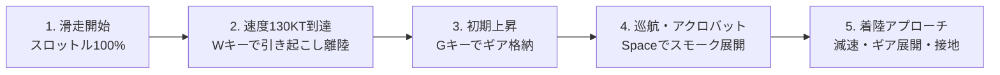

# 航空自衛隊 松島基地 (RJST) ブルーインパルス 3Dフライトシミュレーター<br>Webアプリケーション 総合取扱説明書・操作マニュアル

本シミュレーターは、航空自衛隊 松島基地（宮城県東松島市、38.408646N, 141.215081E）周辺のリアルな地形図 GeoTIFF データ（`miyagi_sendai.tif`）および国土地理院（GSI）高解像度航空写真オルソモザイクをもとに構築された、川崎重工 T-4「ブルーインパルス」の 3D WebGL アクロバット飛行シミュレーターです。

---

## 📑 目次
1. [シミュレーターの概要と特徴](#1-シミュレーターの概要と特徴)
2. [画面構成・UIレイアウト](#2-画面構成uiレイアウト)
3. [モード別機能解説](#3-モード別機能解説)
   - [3-1. 👥 5機編隊モード](#3-1--5機編隊モード)
     - [演目鑑賞（オート再生）と5機コックピット視点切替](#演目鑑賞オート再生と5機コックピット視点切替)
     - [手動操縦（パイロット搭乗）と担当機選択](#手動操縦パイロット搭乗と担当機選択)
   - [3-2. 🛩️ 1機ソロモード](#3-2-️-1機ソロモード)
     - [単独演目鑑賞](#単独演目鑑賞)
     - [単独フリーフライト](#単独フリーフライト)
4. [操縦方法・キーボードショートカット一覧](#4-操縦方法キーボードショートカット一覧)
5. [操縦ガイダンス・インストラクション機能 ([I] キー)](#5-操縦ガイダンスインストラクション機能-i-キー)
6. [ブルーインパルス 7大公式アクロバット演目解説](#6-ブルーインパルス-7大公式アクロバット演目解説)
7. [カメラ視点と視界の特徴](#7-カメラ視点と視界の特徴)
8. [スモーク・環境・計器システム](#8-スモーク環境計器システム)
9. [起動方法と動作環境](#9-起動方法と動作環境)

---

## 1. シミュレーターの概要と特徴

* **実地形 DEM 標高データ & 航空写真**:
  宮城県域（仙台・松島湾・石巻・牡鹿半島・奥羽山脈）の起伏データを 1536×1024 メッシュの Float32 DEM として生成し、国土地理院の空中写真オルソモザイク（3072×2048）を貼り合わせたフォトリアルな 3D 地形。
* **松島基地 (RJST) 精密モデリング**:
  * メイン滑走路 07/25（2,700m × 45m、磁方位 068°/248°）
  * クロス滑走路 15/33（1,500m × 45m）
  * ブルーインパルス専用エプロン、格納庫群、高さ45mの管制塔、PAPI 進入角指示灯、滑走路灯・誘導路灯火。
* **川崎重工 T-4「ブルーインパルス」3D 機体モデル**:
  * 鮮やかなホワイト＆コバルトブルー塗装、1〜6番機デカール、キャノピー＆パイロット。
  * 可動式三輪着陸脚（ギア）、スピードブレーキ（胴体下）、エルロン・エレベーター・ラダーの舵面連動。
  * IHI F3 ターボファン双発エンジン（スロットル連動エキゾーストグロー）。
* **リアルな実機離陸シークエンス**:
  実機と同じ「1〜4番機ダイヤモンド同時離陸 ＋ 5番機滑走路待機→低角ロール離陸→空中合流」を再現。

---

## 2. 画面構成・UIレイアウト

```
+-----------------------------------------------------------------------------------+
| [松島基地 (RJST)]        [👑1番機][🪶2番機][🪶3番機][🎯4番機][⚡5番機]... [JA/EN] [📖マニュアル] |
+-----------------------------------------------------------------------------------+
| [PFD HUD計器]         [ 🛫 リアルタイムフライト指導バナー (Instruction) ]   [操作パネル]    |
| (ピッチラダー,         (離陸手順、ギア操作、目標速度/高度、キーガイド)          | - 5機 / 1機タブ |
|  対気速度, 高度,                                                    | - 演目 / 手動   |
|  マッハ, G負荷,                                                     | - 視点/搭乗機   |
|  スモーク状態)                                                       | - スモーク/環境 |
|                                                                    | - キーガイド    |
+-----------------------------------------------------------------------------------+
| [⏮ ⏪ ▶ ⏩ 🔄 🔊] [================== タイムラインシーク ==================] [テレメトリ計器] |
+-----------------------------------------------------------------------------------+
```

1. **上部ヘッダー (Top Header)**:
   * 基地情報表示（RJST Runway 07/25）
   * カメラ視点切り替えバー（コックピット 1〜5番機、全体、後方、管制塔、観覧席、旋回）
   * 言語切替ボタン（`JA / EN`）
   * 操作マニュアル表示ボタン（`📖 マニュアル`）
2. **左側 HUD 計器 (Primary Flight Display)**:
   * ピッチラダー、水平線、ロール角度インジケーター
   * 中央 FPV（フライトパスベクター / 機首進行方向レティクル）
   * 左側：対気速度（ノット KT）＆ マッハ数（Mach）
   * 右側：気圧高度（フィート FT）＆ メートル換算高度（M）
   * 上部：方位コンパステープ（HDG）、搭乗機・視点バッジ、スモーク稼働表示
   * 下部：Gメーター（過大G警告）、着陸脚（GEAR）、スピードブレーキ（SPD BRAKE）
3. **中央上部 フライト指導バナー (Dynamic Flight Directive Overlay)**:
   * 手動操縦時にリアルタイムで現在の状況（離陸滑走、上昇、編隊追従、アクロバット、着陸進入）に応じた的確なパイロット指示を表示。
   * `[I]` キーまたは操作パネルでいつでも ON / OFF 切替可能。
4. **右側 統合操作パネル (Right Control Panel)**:
   * 「5機編隊モード」と「1機ソロモード」の切り替えタブ
   * 「演目鑑賞 (オート)」と「手動操縦 (パイロット搭乗)」のサブモード切替
   * 各種セレクター（コックピット視点、搭乗機、演目、隊形、スモーク、天候環境）
   * 折りたたみボタン（`◀ / ▶`）
5. **下部 テレメトリ＆タイムラインドック (Bottom Dock)**:
   * 再生／一時停止（`▶ / ⏸`）、再生速度切替（`0.5x / 1.0x / 2.0x / 4.0x`）、リプレイ（`🔄`）、消音切替（`🔊`）
   * 演目進行タイムラインシークバー
   * デジタル計器パネル（対気速度、高度、昇降率、方位、G負荷、ステータス）

---

## 3. モード別機能解説

### 3-1. 👥 5機編隊モード

#### 演目鑑賞（オート再生）と5機コックピット視点切替
ブルーインパルスの公式アクロバット演目を自動フライトで鑑賞します。演目実行中、**どの機体のコックピットから眺めるか**を自由に切り替えられます。

| コックピット | ポジション | 視点の特徴 |
| :--- | :--- | :--- |
| **👑 1番機** | 編隊長 (Flight Leader) | 最前列から滑走路や空を見渡し、後方に2〜5番機を従えるリーダー視点。 |
| **🪶 2番機** | 左翼機 (Left Wingman) | 右前方に1番機、右隣に4番機を見ながら緊密に追従する視点。 |
| **🪶 3番機** | 右翼機 (Right Wingman) | 左前方に1番機、左隣に4番機を見ながら緊密に追従する視点。 |
| **🎯 4番機** | スロット (Slot) | 前方の1番機、左右の2・3番機がつくるダイヤモンドの直後下から見上げる大迫力視点。 |
| **⚡ 5番機** | リードソロ (Lead Solo) | 滑走路で待機後、単独低角ロール離陸を行い、先行する4機に空中合流する視点。 |

#### 手動操縦（パイロット搭乗）と担当機選択
「手動操縦」に切り替えると、**「どの機体に乗るか (操縦担当機)」**を選んでフライトに参加できます。

* **👑 1番機 (編隊長) に搭乗**:
  あなたが操縦桿を握り、2〜5番機（AI）が隊形を維持してあなたの機体に追従します。
* **🪶 2番機 / 3番機 (左翼・右翼) に搭乗**:
  編隊飛行を担う僚機パイロットとして、前方の1番機(AI)に合わせて編隊間隔をキープしながら操縦。
* **🎯 4番機 (スロット) に搭乗**:
  1〜3番機の直後スロット位置に入って編隊操縦。
* **⚡ 5番機 (ソロ機) に搭乗**:
  1〜4番機の編隊を見ながら、自由にスパイラルロールや急上昇・急降下などのダイナミックなアクロバット機動を担当。

---

### 3-2. 🛩️ 1機ソロモード

編隊設定や僚機選択などの余計な項目をすべて排除した、単独フライト専用のシンプルなUIです。

* **演目鑑賞 (オート)**:
  1. 単独垂直大宙返り ＆ バレルロール
  2. 連続スパイラルロール (コークスクリュー)
  3. 滑走路07 離陸 ＆ 急上昇クライム
  4. コンバットピッチ ＆ 滑走路着陸
* **手動操縦 (フリーフライト)**:
  川崎 T-4 の高性能な運動性能を活かし、松島基地や松島湾上空を自由にアクロバット飛行。

---

## 4. 操縦方法・キーボードショートカット一覧

### 操縦操作 (Flight Controls - 航空標準操作体系)
| 操作 | キーボード | 操作パネル / マウス | 説明 |
| :--- | :--- | :--- | :--- |
| **機首上げ (上昇・ピッチアップ)** | **`S`** または **`↓`** | — | **操縦桿を手前に引く**（離陸・上昇） |
| **機首下げ (降下・ピッチダウン)** | **`W`** または **`↑`** | — | **操縦桿を前に倒す**（水平維持・降下） |
| **ロール (左右傾き)** | `A` (左) / `D` (右) または `←` / `→` | — | 操縦桿を左右に倒して機体をロール旋回 |
| **ラダー (左右ヨー・首振り)** | `Q` (左) / `E` (右) | — | 垂直尾翼ラダー / 地上ノーズホイール操舵 |
| **スロットル (加速 / 減速)** | `Shift` / `Z` (加速) <br> `Ctrl` / `X` (減速) | スロットルスライダー (0〜100%) | エンジン推力 (離陸100%, 巡航60%, 着陸アイドル0%) |
| **車輪・着陸脚 (ギア)** | `G` | `[G] ギア` ボタン | 離陸後に格納、着陸進入時に展開 |
| **スピードブレーキ / 空力ブレーキ** | `B` | `[B] エアブレーキ` ボタン | 胴体下のエアブレーキを展開して空中減速 |
| **車輪ブレーキ (地上ブレーキ)** | **`Ctrl` / `X`（長押し）** または **`B`** | — | **着地接地中に長押しで強力ブレーキ（完全停止）** |
| **スモーク切替** | `Space` または `V` | `スモーク ON/OFF` ボタン | 白／三色／虹色スモークの噴射切替 |
| **操縦ガイダンス切替** | `I` | `指導 ON/OFF` ボタン | 画面上部フライト指示バナーの表示切替 |
| **フライト再開・リセット** | `R` | `フライト再開 [R]` ボタン | フライトや墜落後の即座再スタート |

---

### 🛬 着陸から完全停止（フルストップ）までの手順

1. **アプローチ準備（滑走路手前 3〜5km）**:
   - `G` キーを押して **着陸脚（ギア）を展開** します。
   - `B` キーで **エアブレーキを展開** し、`Ctrl` キーでスロットルを下げて速度を **120〜140 KT（約60〜70 m/s）** に減速します。
2. **滑走路進入（ファイナルアプローチ）**:
   - 滑走路 07 または 25 の中心線に機首を向け、降下角 約3度（緩やかな降下）を維持します。
3. **接地（フレア操作・タッチダウン）**:
   - 地面すれすれ（高度 5〜10m）に達したら、**`S` キー（または `↓` キー）を軽くチョンと押して機首をわずかに持ち上げ（フレア操作）**、後輪から優しく接地させます。
4. **減速 ＆ 完全停止（ブレーキ操作）**:
   - 機体が接地したら、**`Ctrl` キー（または `X` キー）を長押ししてスロットルを 0%（アイドル）** にします。
   - 同時に **`Ctrl` キー長押し** または **`B` キー** を押すと、強力な **車輪ブレーキ（ホイールブレーキ）** が作動します。
   - ラダー（`Q` / `E` キー）で滑走路の中心線をキープしながら、速度 0 KT までスムーズに完全停止します。

### UI タイル操作・折りたたみ・表示切替
| 機能 | キーボード | 操作パネル / マウス | 説明 |
| :--- | :--- | :--- | :--- |
| **左上 PFD HUD 折りたたみ** | `H` | タイルヘッダー / `◀ ▶` | 左上のHUD計器タイルを最小化／展開 |
| **下部 計器＆タイムライン 折りたたみ** | `T` | ドックヘッダー / `▲ ▼` | 下部ドックを最小化（リアルタイム小型計器表示）／展開 |
| **右側 操作パネル 折りたたみ** | — | パネル右上 `◀ / ▶` | 右側のフライト設定パネルを最小化／展開 |
| **UI 画面縮尺ズーム** | `[` (縮小) / `]` (拡大) | ヘッダー `🖥️ - / +` | UIサイズを5%単位で拡大・縮小調整 |
| **UI 画面縮尺リセット** | `0` (Alt/Ctrl+0) | ヘッダー `↺` ボタン | UI縮尺を標準(85%)に戻す |
| **マニュアル表示** | `M` | ヘッダー `📖 マニュアル` | 操作説明書モーダルを開閉 |
| **日英 言語切替** | — | ヘッダー `JA / EN` | 日本語／英語の表示切替 |

### カメラ視点切り替え (Camera Views)
| 視点番号 | キー | 視点名 | 説明 |
| :---: | :---: | :--- | :--- |
| **1** | `1` | 🌐 5機全体ビュー / ✈️ コックピット | 5機全体俯瞰（5機時）／ コックピット（1機時） |
| **2** | `2` | 👑 1番機コックピット / 🎥 後方追従 | 1番機FPV（5機時）／ 後方追従（1機時） |
| **3** | `3` | 🪶 2番機コックピット / 🪶 翼端カメラ | 2番機FPV（5機時）／ 翼端カメラ（1機時） |
| **4** | `4` | 🪶 3番機コックピット / 🗼 松島管制塔 | 3番機FPV（5機時）／ 管制塔カメラ（1機時） |
| **5** | `5` | 🎯 4番機コックピット / 🎪 地上観覧席 | 4番機FPV（5機時）／ 観覧席カメラ（1機時） |
| **6** | `6` | ⚡ 5番機コックピット / 🔄 360°旋回 | 5番機FPV（5機時）／ 自由旋回カメラ（1機時） |
| **7** | `7` | 🎥 後方追従カメラ (5機時) | 編隊後方追従 |
| **8** | `8` | 🗼 松島管制塔カメラ (5機時) | 高さ45mの管制塔トップからの望遠追尾 |
| **9** | `9` | 🎪 地上観覧席カメラ (5機時) | エプロンからの見上げ視点 |

---

## 5. 操縦ガイダンス・インストラクション機能 ([I] キー)

手動操縦時に、状況に応じたフライト指示を画面上部にリアルタイム表示します。



* **離陸手順 (Takeoff)**: スロットルを100%に上げ加速 ➔ 130KT到達で `W` キーを引いて機首を10〜15°引き起こし離陸。
* **上昇手順 (Climb)**: 離陸後、`G` キーで車輪を格納 ➔ 1,500FT・250KTを目安に水平飛行へ移行。
* **機動・スモーク (Maneuvers)**: `Space` キーでスモーク噴射。宙返り（ループ）、ロール、旋回を実施。
* **着陸手順 (Landing)**: `F` キーでスロットル40%減速 ➔ `G` キーでギア展開 ➔ `B` キーでスピードブレーキを活用し滑走路07へ着陸。
* **プロモード (OFF)**: `[I]` キーを押して指導バナーを消し、HUD計器と視界のみの本格フライトを楽しめます。

---

## 6. ブルーインパルス 7大公式アクロバット演目解説

1. **4機ダイヤモンド離陸 ＆ 5番機ロールオン空中合流**:
   1〜4番機がダイヤモンド隊形で同時離陸。5番機は滑走路で待機後、低角ロール離陸を行い、急上昇して空中で4機に合流し5機デルタを完成。
2. **デルタループ ＆ ロール (5機編隊大宙返り)**:
   350KTで進入し、5機密集デルタ隊形のまま垂直上昇・4Gの大ループを描き、頂点でバレルロールを実施。
3. **スタークロス (大空の巨大五芒星)**:
   垂直急上昇から5機が四方八方に扇状散開し、スモークで大空いっぱいに巨大な星を描く。
4. **レベルサンライズ (5機扇状大開花ブレイク)**:
   水平超密集デルタから、合図とともに5機が一斉に左右上下へ扇状に大開花散開。
5. **チェンジオーバー・ターン (隊形変換旋回)**:
   縦一列トレイル隊形で進入し、大半径旋回を行いながらダイヤモンド、デルタへと流麗に変形。
6. **コークスクリュー (4機直進 ＆ 5番機螺旋ロール)**:
   1〜4番機が直進白スモークを引く中、5番機がその外周を連続バレルロールで螺旋状に包み込む。
7. **ローリング・コンバット・ピッチ ＆ 編隊着陸**:
   松島基地滑走路07上空を低空通過後、1番機から順次ブレイク旋回し、整然と滑走路へ着陸。

---

## 7. カメラ視点と視界の特徴

* **パイロット目線 (Head-Look)**:
  コックピット視点時、バンク角や旋回に合わせてパイロットの視線が自然に僚機や旋回先を向くリアルな視線制御を実装。
* **管制塔カメラ (Tower Cam)**:
  松島基地の管制塔最上階に設置された定点カメラから、進入・離陸・上空通過する機体を自動望遠追従。
* **地上観覧席カメラ (Ground Spectator)**:
  航空祭当日のエプロン観覧エリアから頭上を通過するブルーインパルスを見上げる臨場感溢れる視点。

---

## 8. スモーク・環境・計器システム

* **スモークカラー切替**:
  * `⚪ 白`: 航空自衛隊標準の濃厚な白スモーク。
  * `🔴🔵 三色`: 1/4/5番機（白）、2番機（青）、3番機（赤）によるトリコロールスモーク。
  * `🌈 虹`: 5機それぞれ異なる鮮やかなレインボースモーク。
* **環境・天候プリセット**:
  * `青空 (晴天)`: 抜けるような青空と松島湾の海面。
  * `夕景 (ゴールデンアワー)`: 茜色に染まる空と機体の美しいシルエット。
  * `航空祭 (薄曇り)`: スモークの航跡が最もくっきりと映える航空祭仕様。
  * `ナイトフライト`: 松島基地の滑走路進入灯火群が輝く夜間飛行。

---

## 9. 起動方法と動作環境

### 起動手順
```bash
# プロジェクトディレクトリに移動
cd flight_blueimpulse

# 依存パッケージのインストール (初回のみ)
npm install

# 開発サーバーの起動
npm run dev
```

ブラウザで `http://127.0.0.1:5173/` を開くとシミュレーターが起動します。

### 推奨動作環境
* **ブラウザ**: Google Chrome、Microsoft Edge、Safari、Firefox（WebGL 2.0 対応ブラウザ）
* **デバイス**: PC / Mac（キーボード・マウス操作推奨）
